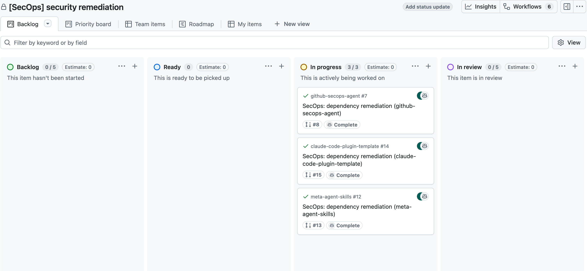

# github-secops-agent

This repository provides **SecOps dependency remediation orchestration** for GitHub: **granular [Claude Code](https://code.claude.com/docs/en/skills) skills**, shell scripts, and the **[GitHub CLI](https://cli.github.com/) (`gh`)** as the primary interface. **`github-secops-guard`** (the [`@github-secops-agent/ghclt`](packages/ghclt) package) validates policy before mutations. **Only GitHub Copilot** authors commits on remediation branches; this tooling coordinates **issues, pull requests, comments, and GitHub Projects (v2)**—it does not replace `gh` or push code to target repositories.

This is **not** a hosted product. It is workflows, config contracts, and a small CLI for operators and agents adopting the same runbooks.

## Who this is for

- **Security and engineering operators** who run or adopt org-scale vulnerable-dependency remediation using GitHub-native tools.
- Teams that want **policy guardrails** (allowed orgs/repos) before opening issues or calling `gh` from scripts.

For **developing** this repository (TypeScript, skills, tests), see [CONTRIBUTING.md](CONTRIBUTING.md).



## Prerequisites

- **[`gh`](https://cli.github.com/)** installed and authenticated (`gh auth login`) for the orgs/repos you touch.
- **Node.js** and **pnpm** — versions in [`.node-version`](.node-version) and root [`package.json`](package.json) `engines` (currently Node `>=24.13.0`, pnpm `>=10.28.1`).
- **Optional:** [Claude Code](https://code.claude.com/) to invoke the skills under [`.claude/skills/`](.claude/skills/). Skills can also be followed manually with the same `gh` commands.

Linting and formatting in this repo use [Trunk](https://trunk.io/) via project dependencies; you do not need a global Trunk install for the default contributor workflow.

## Configuration (two files at the repo root)

SecOps **policy** and **GitHub Project (v2) binding** are separate; do not put Project ids inside `.github-secops-agent.json`.

| File                                                                  | Role                                                                                                                                                                                                                      |
| --------------------------------------------------------------------- | ------------------------------------------------------------------------------------------------------------------------------------------------------------------------------------------------------------------------- |
| **[`.github-secops-agent.json`](.github-secops-agent.json.template)** | SecOps policy: organizations, discovery hints, orchestration (e.g. priority, nudge rounds), optional `notifications` for @mentions. Copy from [`.github-secops-agent.json.template`](.github-secops-agent.json.template). |
| **[`project-config.json`](project-config.json.template)**             | Project binding: `project_id`, optional `project_title` for `gh issue create --project`, etc. Copy from [`project-config.json.template`](project-config.json.template).                                                   |

To bootstrap or refresh these files interactively, use the **[secops-init-config](.claude/skills/secops-init-config/SKILL.md)** skill (questionnaire: [references/questionnaire.md](.claude/skills/secops-init-config/references/questionnaire.md)).

## Policy guard CLI (`github-secops-guard`)

Build the CLI once, then use it to validate config and enforce **allowed org/repo** policy before any script runs `gh` against a target.

```bash
pnpm install
pnpm --filter @github-secops-agent/ghclt build
```

After a successful build, run the CLI via Node from the repository root (the workspace root does not add `github-secops-guard` to `PATH` unless you install or link the package yourself):

```bash
node packages/ghclt/dist/cli.js --help
```

If you have the `github-secops-guard` binary on your `PATH` (for example from `npm link` or a global install of the package), `github-secops-guard --help` is equivalent.

**Subcommands** (see `--help` on each; **`--config`** is accepted on the root command and repeated on subcommands that load policy):

| Command                      | Purpose                                                                                                                    |
| ---------------------------- | -------------------------------------------------------------------------------------------------------------------------- |
| `config-schema`              | Print JSON Schema (draft-07) for `.github-secops-agent.json` to stdout.                                                    |
| `validate-config`            | Validate SecOps JSON and repo-root `project-config.json` when present.                                                     |
| `validate-repo <owner/repo>` | Reject if the repo is not allowed by policy.                                                                               |
| `validate-org <org>`         | Reject if the org is not allowed by policy.                                                                                |
| `pr-check`                   | Classify PR/check status from **JSON files** produced by `gh pr view` / optional `gh run list` — **does not invoke `gh`**. |

**Environment:** `SECOPS_CONFIG` can point at a non-default policy file; `GITHUB_WORKSPACE` affects how the repo root is resolved when validating `project-config.json` (see implementation in [`packages/ghclt/src/cli.ts`](packages/ghclt/src/cli.ts)).

**Discovery:** Remediation target discovery (Dependabot alerts, repo lists, filters) is **manual `gh api` (+ optional `jq`)** per skills—**there is no batch queue JSON emitter in `ghclt`**.

## Workflow: submit, observe, act

Long-running remediation is split into **planes** so you are not tied to one long chat session:

1. **Submit** — Create/link issues, attach **GitHub Project** rows, assign **@copilot** where policy allows. Run **`validate-repo`** (or **`validate-config`**) before mutations.
2. **Observe** — On a schedule you choose: `gh`, **PR checks**, **Copilot agent-task** metadata, Project fields. See [docs/secops-observe-flow.md](docs/secops-observe-flow.md) for an ordered observe recipe (issue → PR → checks → agent task).
3. **Act** — Nudge on failing CI, post evidence, or comment with @mentions from policy **`notifications`**.

Full narrative: [docs/product_design.md](docs/product_design.md).

## SecOps skills (this repo)

Granular **`secops-*`** skills live under [`.claude/skills/`](.claude/skills/). They follow a **single-outcome** pattern: policy guard, then one `gh`/CLI surface. **For the full skill table and Claude Code–specific setup** (plugins, github-project-skills), see **[CLAUDE.md](CLAUDE.md)**.

At a glance: **discover** targets → **create** remediation issue → **assign** Copilot → **check** PR checks → **inspect** agent tasks → **nudge** on CI → **post** evidence.

## Documentation map

| Document                                                   | Contents                                                                  |
| ---------------------------------------------------------- | ------------------------------------------------------------------------- |
| [docs/product_design.md](docs/product_design.md)           | Product goals, config model, `gh`-first boundaries, planes.               |
| [docs/secops-observe-flow.md](docs/secops-observe-flow.md) | Observe-plane recipe (issue → PR → checks → agent task).                  |
| [docs/adr/README.md](docs/adr/README.md)                   | Architecture Decision Records index.                                      |
| [CLAUDE.md](CLAUDE.md)                                     | Claude Code usage: skills table, plugins, `github-secops-guard` examples. |
| [CONTRIBUTING.md](CONTRIBUTING.md)                         | Build, test, lint, and how to change `ghclt` or skills.                   |

## License

Apache-2.0
