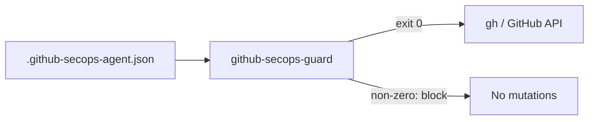

# 2. SecOps policy guardrails and skill shell scripts

Date: 2026-04-15

## Status

Accepted

## Context

SecOps automation must not mutate GitHub state against organization policy. Operators configure a single canonical policy file (`.github-secops-agent.json` from the repository template). Shell skills that discover orgs and repositories, or call `gh`, need a consistent allow/deny gate so mistakes and drift are blocked before any API mutation.

## Decision

1. **Single policy source:** One policy file shape, documented and validated against the same schema used at runtime (see `docs/secops-agent-config.md` and `.github-secops-agent.json.template`).
2. **Programmatic checks:** The `packages/ghclt` library exposes `validateTargetRepository` and `validateOrganizationId` so callers enforce the same rules as the guard CLI.
3. **Mandatory gate:** The `github-secops-guard` CLI (bin from `ghclt`) must exit successfully before any skill or script performs mutations via `gh` or other GitHub APIs. No bypass path for “quick” runs.
4. **Discovery from config only:** Skills that loop over organizations read allowed orgs **only** from the configured policy (e.g. with `jq`), not from ad hoc lists or environment defaults that widen scope.
5. **Self-contained skill scripts:** Each skill’s `*.sh` scripts are **self-contained**—no shared `common.sh` or hidden sourcing that obscures what runs in a given invocation. Duplication is acceptable for clarity and auditability.

## Consequences

- **Positive:** Policy, validation, and CLI stay aligned; reviews can focus on one file and one guard command.
- **Positive:** Shell scripts remain easy to read top-to-bottom without cross-file indirection.
- **Trade-off:** Some duplication across scripts; mitigated by small, copy-paste-friendly patterns and tests where applicable.
- **Risk:** Forgetting to invoke the guard before `gh`—mitigated by documenting the pattern in `CLAUDE.md` and skill instructions.
