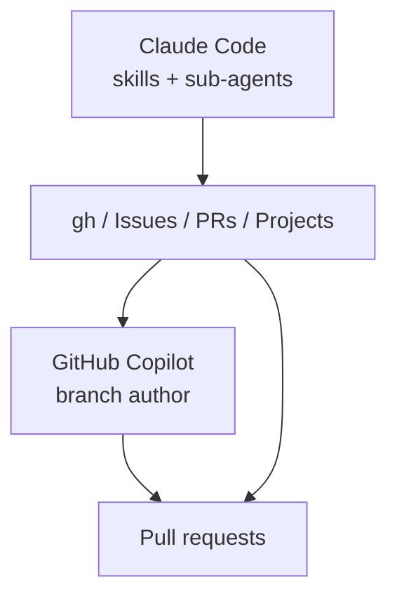

# 3. SecOps orchestration with Claude Code Copilot and gh

Date: 2026-04-15

## Status

Accepted

## Context

This repository coordinates security-oriented work across many GitHub repositories. We need a clear split between **planning and orchestration** (local agents, skills, CLI) and **execution on branches** (who may push code and open PRs). GitHub’s web UI and APIs (Issues, PRs, Comments, Projects v2) are the shared control plane.

## Decision

1. **Claude Code as orchestrator:** Use Claude Code with **granular skills** and **sub-agents** (e.g. `secops-batch-orchestrator`, `secops-repo-runner`) to plan work, batch operations, and drive repo-scoped tasks.
2. **GitHub Copilot as sole branch author:** **GitHub Copilot** is the **only** component that authors branch changes for the automated SecOps flow; other tools coordinate via Issues, PRs, comments, and Projects—not by pushing competing branch content for the same workflow.
3. **`gh` first:** Prefer the official GitHub CLI (`gh`) for API and workflow interactions from scripts and skills unless a capability is unavailable there.
4. **Project and Issue automation:** Use [github-project-skills](https://github.com/yu-iskw/github-project-skills) for Issues and Projects integration where applicable; use optional `packages/ghclt` helpers for typed validation and guardrails (see ADR 0002).

## Consequences

- **Positive:** Clear ownership: orchestration vs. Copilot-authored implementation reduces conflicting pushes and clarifies review boundaries.
- **Positive:** Skills and `gh` stay portable and scriptable; Project skills align with GitHub-native workflows.
- **Trade-off:** Orchestration logic lives in multiple places (skills, `gh`, optional `ghclt`); documentation must stay in sync.
- **Risk:** Assuming Copilot availability or behavior without verification—mitigated by treating Copilot as an integration with explicit triggers and checks (see ADR 0004).
