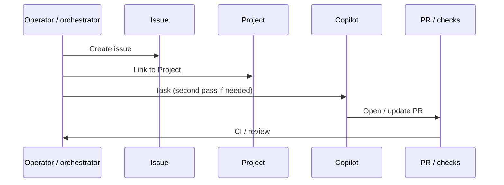

# 4. Issue Project Copilot workflow order and Kanban

Date: 2026-04-15

## Status

Accepted

## Context

Work must be traceable from intent (issue) through planning (project) to implementation (Copilot) and delivery (PR). Concurrency and board semantics are easy to confuse with GitHub’s own queues and automations.

## Decision

1. **Canonical order:** **Create issue → link to Project → Copilot task** (run a second Copilot pass only when required). Do not rely on an ad hoc order that skips the issue or project link when those are part of the team’s tracking contract.
2. **Orchestrator concurrency:** Batch parallelism (how many repos to drive at once) lives in the **orchestrator** (shell, CI, agent fan-out), **not** in `.github-secops-agent.json`. GitHub Copilot’s internal queue is separate—see [ADR 0007](0007-orchestrator-concurrency-outside-policy.md).
3. **Kanban / status updates:** Prefer **GitHub Project automations** to move items through columns when available. If automations are insufficient, use a documented fallback such as the **`secops-project-board-sync`** sub-agent (Task tool; same plugin skills as runbooks), keeping behavior explicit in runbooks.
4. **No unverified assumptions:** Do **not** assume Copilot updates Project fields or moves cards without verification; confirm in the target org/project setup or document manual steps.

## Consequences

- **Positive:** Predictable ordering improves auditability and reduces “orphan” work not visible on the board.
- **Positive:** Separating orchestrator concurrency from Copilot queue semantics avoids mis-tuned limits and false expectations.
- **Trade-off:** Project automations vary by org; fallback scripts add a second path to maintain.
- **Risk:** Drift between board state and reality if automations are misconfigured—mitigated by validation skills and periodic checks.
