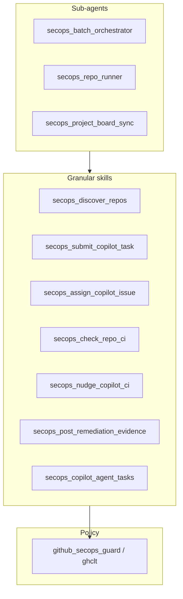

# 5. SecOps granular skills vs sub-agents (taxonomy)

Date: 2026-04-15

## Status

Accepted

## Context

The repository has grown a set of **`secops-*`** [Claude Code skills](https://code.claude.com/docs/en/skills) alongside [sub-agents](https://code.claude.com/docs/en/sub-agents). Without explicit rules, contributors might:

- Add a **second skill** that overlaps **GitHub Project** updates already owned by the **`secops-project-board-sync`** sub-agent, or
- Push **multi-step orchestration** into a single `SKILL.md`, making skills harder to compose and discover.

[ADR 0002](0002-secops-policy-guardrails-and-skill-shell-scripts.md) defines **policy guardrails** and shell script patterns; [ADR 0003](0003-secops-orchestration-with-claude-code-copilot-and-gh.md) defines **who orchestrates vs who authors branches**. This ADR records **taxonomy**: what belongs in a **granular skill** vs a **sub-agent**.

## Decision

1. **Granular skills (atomic verbs)**
   Each SecOps **`SKILL.md`** should express **one primary outcome**: e.g. discover queue, create issue, assign `@copilot`, check PR CI status (JSON, one shot per invocation), nudge on CI, post evidence, list/view Copilot agent tasks (`gh agent-task`, preview). **Repeated checks** (wait/retry) belong in **sub-agents**, not inside the check skill.
   **Shell scripts** under `.claude/skills/*/scripts/` follow the canonical pattern: resolve repo root, load `SECOPS_CONFIG` / `packages/ghclt/dist/cli.js`, run **`validate-repo`** (or **`validate-config`** when no target repo applies), then **`exec gh …`** or **`exec node …`** for a single CLI surface.

2. **Sub-agents (orchestration)**
   - **`secops-repo-runner`** and **`secops-batch-orchestrator`** coordinate **ordered sequences** of skills (and human notifications).
   - **`secops-project-board-sync`** coordinates **github-project-skills** plugin capabilities (`gh-project-management`, `gh-verifying-context`) and multi-field Project updates—**not** a one-line `gh` wrapper.

3. **Non-goals**
   Do **not** add another skill that duplicates **Project** field updates covered by **`secops-project-board-sync`** unless the action is a **single**, well-scoped `gh` command with a distinct verb and guard path.

4. **When to add a new SecOps skill**
   Prefer **composing** existing skills first. Add a new skill only when:
   - It is meaningfully invoked **standalone** (debugging, automation, or runbooks); **and**
   - After policy guard, it maps to a **single** `gh` (or `github-secops-guard`) **surface**; **and**
   - It is **not** adequately covered by **two existing skills** in sequence.

5. **Deferred options (documented only)**
   - **`secops-validate-config`**: optional thin wrapper around `github-secops-guard validate-config` for **agent discoverability**—see [CLAUDE.md](../../CLAUDE.md) CLI examples.
   - **`secops-find-remediation-pr`**: optional only if teams repeatedly need PR discovery **without** running `check-repo-ci.sh`; today, discovery commands live under **secops-check-pr-checks** (“Discover PR”).



## Consequences

- **Positive:** Clear expectations for **skill** vs **sub-agent** boundaries; easier reviews and less duplication.
- **Trade-off:** Some **`gh`** one-liners may stay in skill docs (e.g. PR discovery) instead of a dedicated skill—acceptable until repetition justifies a new skill per §5.
- **Risk:** Drift if new skills are added without the checklist—mitigated by linking this ADR from [CLAUDE.md](../../CLAUDE.md) and product design.

**Related:** [ADR 0006](0006-submit-observe-act-and-independent-project-config.md) clarifies **submit / observe / act** and **independent** `project-config.json`; sub-agents remain optional for orchestration, not mandatory for monitoring.

## Future work (optional)

If **config validation** should be first-class for agents, add a minimal script (example pattern only):

```bash
#!/usr/bin/env bash
set -euo pipefail
ROOT="$(git rev-parse --show-toplevel)"
CONFIG="${SECOPS_CONFIG:-$ROOT/.github-secops-agent.json}"
CLI="$ROOT/packages/ghclt/dist/cli.js"
[[ -f $CONFIG && -f $CLI ]] || exit 1
exec node "$CLI" validate-config --config "$CONFIG"
```

Pair with a **`secops-validate-config`** skill only when discoverability outweighs documenting the CLI in [CLAUDE.md](../../CLAUDE.md).
