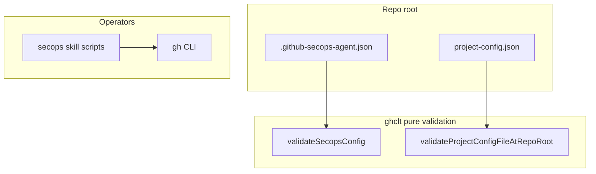

# 6. Submit, observe, act; independent project config

Date: 2026-04-16

## Status

Accepted

## Context

Copilot agent work can run for a long time (tens of minutes per turn). Embedding a **continuous poll loop** inside a single Claude Code session is costly and easy to rate-limit. Operators still need a **clear operational model**: enqueue work, understand progress, and act (nudge Copilot, notify humans, post evidence).

Separately, **GitHub Project (v2) binding** (Projects node id, org/repo metadata) is orthogonal to **SecOps policy** (orgs, exclusions, orchestration, notification mentions). Evidence cadence and formats are documented in skills, not duplicated in policy JSON. Duplicating Project identity inside `.github-secops-agent.json` created coupling and validation that compared two files for the same id.

## Decision

1. **Planes:** Document and implement around **submit** (enqueue: issue, Project row, assign Copilot), **observe** (PR checks, `gh agent-task`, Project fields, `gh api` as needed), and **act** (nudge, evidence, human @mentions). **No monolithic shell facade** is required; humans and Claude use **per-skill scripts** under `.claude/skills/secops-*/scripts/` and **`gh`** directly.

2. **Independent config files (repo root):**
   - **`.github-secops-agent.json`** — SecOps policy only; optional **`notifications`** (mention lists). **No** `githubProject` / Project node id.
   - **`project-config.json`** — GitHub Project binding only (`project_id`, etc.). Templates: [`.github-secops-agent.json.template`](../../.github-secops-agent.json.template), [`project-config.json.template`](../../project-config.json.template).

3. **`packages/ghclt`** validates each JSON **independently** (`validateSecopsConfig`, `validateProjectConfigJson` / file at repo root). **No** cross-file equality check. **`ghclt` does not spawn `gh`** for validation or `pr-check` ingest (shell produces `gh` JSON files).

4. **Sub-agents** ([ADR 0005](0005-secops-granular-skills-vs-subagents.md)) remain **optional** for batch submit and Project sync; they are **not** the only way to run observe/act.

## Consequences

- **Easier:** Clear credentials via `gh auth login`; fewer long-lived agent sessions; configuration concerns separated.
- **Harder:** Operators must maintain **two** files; if **github-project-skills** writes under `.github/`, teams may need to **copy** to repo-root `project-config.json` until the plugin supports that path.
- **Migration:** Remove `githubProject` from existing `.github-secops-agent.json`; add `project-config.json` when using Projects.
- **Risks:** `gh agent-task` remains preview; GraphQL Project updates can hit rate limits—document batching in runbooks.

## Related

- [ADR 0004](0004-issue-project-copilot-workflow-order-and-kanban.md) — Issue → Project → Copilot order.
- [ADR 0005](0005-secops-granular-skills-vs-subagents.md) — Skills vs sub-agents taxonomy (still applies; observe/act may be human-driven).
