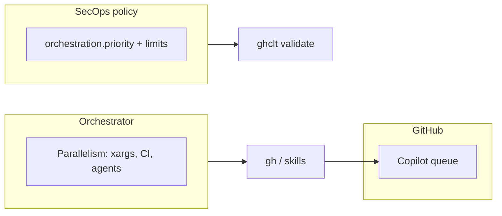

# 7. Orchestrator concurrency outside SecOps policy

Date: 2026-04-16

## Status

Accepted

## Context

`.github-secops-agent.json` previously allowed **`orchestration.maxConcurrentRepos`**, implying a cap on **orchestrator repo threads**. In practice, **`packages/ghclt`** did not enforce that limit in discovery or other paths; the field was easy to confuse with **GitHub Copilot’s server-side agent queue**, which is unrelated.

Keeping **`ghclt`** focused on **policy validation** and **deterministic helpers** (queue ordering, PR/check classification) avoids duplicating concerns that belong to **whoever runs batch workflows** (interactive Claude, sub-agents, CI, shell).

## Decision

1. **Remove `maxConcurrentRepos`** from the SecOps policy schema and from **`SecOpsOrchestration`** in **`packages/ghclt`**.
2. **`validateSecopsConfig`** **rejects** configs that still set **`orchestration.maxConcurrentRepos`**, with an error that points operators to **`docs/product_design.md`** and orchestrator-level controls (shell, CI, agent fan-out).
3. **Document** that **parallelism** is chosen by the **orchestrator**; **priority sorting** (`orchestration.priority`) remains policy.

## Consequences

- **Positive:** Clear boundary—policy vs runtime batch tuning; no silent no-op field in JSON.
- **Positive:** Aligns with Copilot queuing semantics (GitHub-side) vs local/API throttling (orchestrator-side).
- **Trade-off:** **Breaking change** for existing JSON that included the field; operators must delete the key and set parallelism outside the file (e.g. `SECOPS_PARALLEL`, `xargs -P`).

## Related

- [ADR 0004](0004-issue-project-copilot-workflow-order-and-kanban.md) (workflow order; item 2 updated to reference this ADR).
- [Product design: concurrency](../product_design.md) (`Concurrency: orchestrator vs Copilot queue`).
