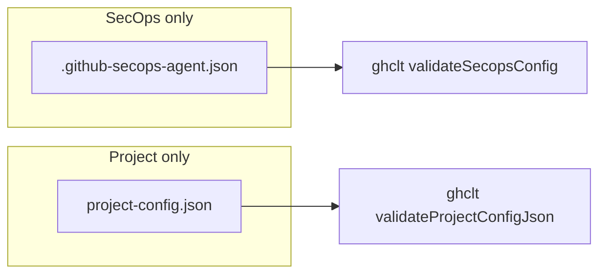
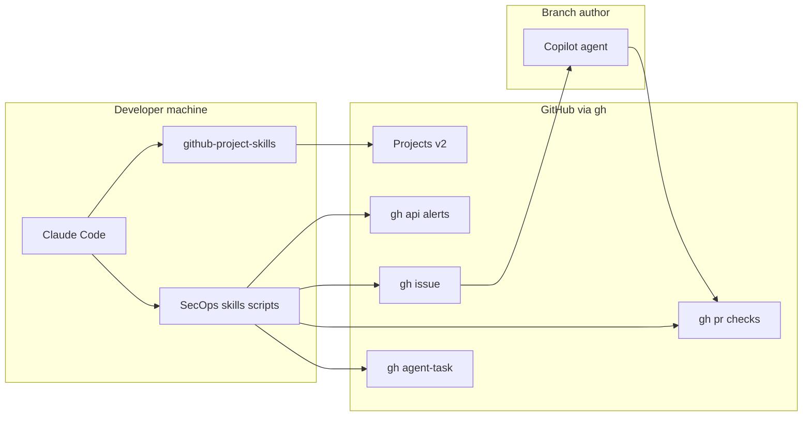
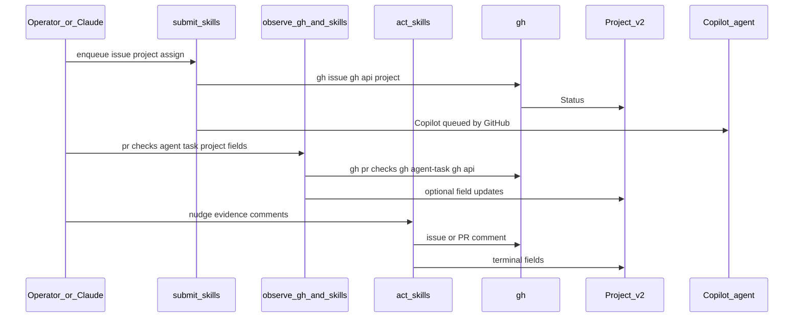
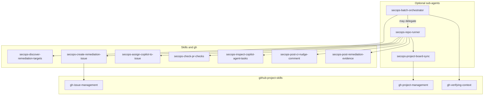

# Product design: SecOps dependency remediation orchestrator

This document describes the **GitHub SecOps agent** approach for **org-scale vulnerable dependency remediation** using **Claude Code**, **granular agent skills**, optional **sub-agents**, the **github-project-skills** plugin, and **`gh`** as the primary GitHub interface. **Only GitHub Copilot** authors commits on target branches; orchestration uses **Issues, Pull Requests, Comments, and GitHub Projects (v2)**—not direct pushes from this tooling.

## Goals

| Goal                  | Description                                                                                                                                                                                                         |
| --------------------- | ------------------------------------------------------------------------------------------------------------------------------------------------------------------------------------------------------------------- |
| **MVP runtime**       | Interactive **Claude Code** on a developer machine (later: dedicated runner or CI).                                                                                                                                 |
| **Integration**       | **GitHub-native** only: [`gh`](https://cli.github.com/), REST/GraphQL via `gh api`. No undocumented Copilot UI automation.                                                                                          |
| **Branch authorship** | **Copilot only** on branches. Claude Code and these skills **do not** `git push` to target repos.                                                                                                                   |
| **Done criterion**    | **Required checks** on the remediation PR are **green**, within **nudge rounds** and policy; otherwise **partial** with **explicit user-visible** notices.                                                          |
| **Discovery**         | **Org scope + exclude patterns** (and session filters) intersected with repos that have **security findings** (e.g. Dependabot alerts via `gh api`). No repo allowlist in `.github-secops-agent.json`.              |
| **Execution**         | **Priority queue** in policy (`orchestration.priority`); **batch parallelism** is an **orchestrator** concern (shell, CI, agents)—**not** in `.github-secops-agent.json`. Copilot scheduling stays **GitHub-side**. |
| **Visibility**        | **GitHub Project (v2)** as the human dashboard; progress and **next action** live in **Project custom fields** and are cross-checked with **`gh`** (issues, PRs, checks, `gh agent-task`).                          |
| **Evidence**          | Target: **structured issue/PR summary + orchestrator run log**; MVP may use **links-only** with a documented audit gap.                                                                                             |

## Configuration (two independent files, repo root)

SecOps policy and GitHub Project binding are **separate** files with **no duplicated fields** (no Project id inside `.github-secops-agent.json`).

| File                                                                               | Role                                                                                                                                                                                                                                     | Template                                                                      |
| ---------------------------------------------------------------------------------- | ---------------------------------------------------------------------------------------------------------------------------------------------------------------------------------------------------------------------------------------- | ----------------------------------------------------------------------------- |
| **[`.github-secops-agent.json`](../.github-secops-agent.json.template)**           | **SecOps policy:** `version`, `organizations`, `orchestration`, optional **`notifications`** (GitHub logins for @mentions on **issue** vs **PR** paths). Evidence format and observe cadence are **skill conventions**, not JSON fields. | [`.github-secops-agent.json.template`](../.github-secops-agent.json.template) |
| **[`project-config.json`](../project-config.json.template)** (repository **root**) | **GitHub Project (v2) binding only:** `project_id`, optional **`project_title`** (CLI board title for `gh issue create --project`), optional `owner`, `repo`, `project_number`, `set_at`.                                                | [`project-config.json.template`](../project-config.json.template)             |

- **`packages/ghclt`** validates each JSON **independently** (`github-secops-guard validate-config`). It does **not** call `gh`; shell skills and operators run `gh`.
- If **`gh-set-active-project`** (github-project-skills) still writes under `.github/`, **copy or symlink** the result to repo-root **`project-config.json`** so tooling has a single path (see template).



## `gh`-first policy and `ghclt` boundary

1. Prefer **`gh`** for everything it supports: `gh api` (`--paginate`, `-f`), `gh pr view`, `gh pr checks`, `gh issue`, `gh agent-task`, etc.
2. Use **`gh api`** for endpoints without a dedicated subcommand (e.g. org Dependabot alerts). Avoid `curl` + raw PATs when `gh` can attach credentials.
3. **`packages/ghclt`** provides **validation** (`.github-secops-agent.json`, `project-config.json` shape) and **PR/check classification** from **JSON files produced by shell** (`gh pr view --json …` → `github-secops-guard pr-check`). **`ghclt` does not spawn `gh`** for those paths. **Discovery** of remediation targets is **manual** (`gh api` + policy + optional `jq`); see [secops-discover-remediation-targets](../.claude/skills/secops-discover-remediation-targets/SKILL.md)—Dependabot alerts, optional repo staleness/activity filters, intersections; there is **no** built-in batch JSON queue in `ghclt`.

## Claude Code primitives

- **Skills:** [Skills](https://code.claude.com/docs/en/skills) — one **focused** skill per capability (discover vs submit vs check vs nudge) for composability.
- **Sub-agents:** Optional **batch** orchestration; not required for **monitoring** (see below).
- **Agent teams:** Coordinator + workers for batch runs if you use them.

## Architecture



### Role of [github-project-skills](https://github.com/yu-iskw/github-project-skills)

- **Auth:** `gh auth login` — single credential surface.
- **Project binding:** Maintain repo-root **`project-config.json`** (see [Configuration](#configuration-two-independent-files-repo-root)) so **`gh-verifying-context`** and SecOps scripts know the active Project.
- **Issues / Projects:** **`gh-issue-management`**, **`gh-project-management`** — boards, fields, triage.

**Boundary:** That plugin handles **generic** GitHub project workflows. This repository adds **SecOps-specific** skills and shell scripts (discovery, Copilot task text, PR check snapshots, evidence).

### Copilot task prompt

Remediation instructions for Copilot follow the supply-chain playbook (adapt per ecosystem):

- [Independent prompt to resolve vulnerable dependencies (gist)](https://gist.github.com/yu-iskw/7a7412abd7d332fc09f428b8d0d90998)

## Planes: submit, observe, act (no monolithic facade)

Long-running Copilot work (**30+ minutes** per turn is possible) should **not** require a single Claude session to **poll continuously**. Instead:

1. **Submit (enqueue):** create/link issue, link **Project** row, assign **@copilot** — skills **secops-create-remediation-issue**, **secops-assign-copilot-to-issue**, plus **`github-secops-guard validate-repo`** before mutations. Use **`project-config.json`** when a step needs the Project **node id**.
2. **Observe:** operators or Claude run **role-aligned** steps on a **cadence** they choose: **`gh`** + **secops-check-pr-checks** (PR checks, one shot), **secops-inspect-copilot-agent-tasks** (`gh agent-task`, preview), **`gh pr view`**, Project column queries via **`gh api`**. For a precise picture, combine **agent-task** and **PR/check** signals (both matter). **Project v2 custom fields** hold durable **Status**, **pending action**, **blocker**, etc. Ordered steps and issue→PR discovery: [secops-observe-flow.md](secops-observe-flow.md).
3. **Act:** after human review of the board/fields, run **secops-post-ci-nudge-comment**, **secops-post-remediation-evidence**, or **`gh issue comment` / `gh pr comment`** with @mentions from **`.github-secops-agent.json`** → **`notifications`** (agent-task issues → **issue** comment; PR/CI issues → **PR** comment).

There is **no** single `secops-facade.sh` requirement: use **small scripts under each skill** and documented **`gh`** invocations.



### Workflow order: Issue → Project → Copilot (submit path)

Traceability stays anchored on the **GitHub Project** and **issues**:

1. **Create the issue** — **secops-create-remediation-issue**.
2. **Link the issue** to the batch Project and set **Status** — **gh-project-management** / sub-agent or manual `gh api` using **`project-config.json`**.
3. **Assign Copilot** if not done at create time — **secops-assign-copilot-to-issue**.
4. **Observe and act** — as above; **not** a mandatory embedded poll loop in Claude.

### Concurrency: orchestrator vs Copilot queue

- **Policy** holds **`orchestration.priority`** (how to sort the dependabot discovery queue) and **`orchestration.nudgeRounds`** for act loops. **Poll interval** and **partial timeout** are **operator / skill conventions** (not in JSON). It does **not** include a max-parallelism field; **`ghclt`** validates policy and does not run a repo-thread pool.
- **Orchestrator** (operator, Claude, sub-agent, or CI) decides how many repos to touch in parallel—e.g. **`xargs -P`**, a job matrix, or **`SECOPS_PARALLEL`** in a wrapper script. That throttles **local** `gh` / API usage and attention; it is separate from GitHub’s **Copilot agent queue**, which schedules work **server-side**.

Example (parallel cap in shell only; not part of the JSON policy file):

```bash
jq -r '.[]' repos.json | xargs -P "${SECOPS_PARALLEL:-1}" -I {} \
  sh -c 'github-secops-guard validate-repo "$1" && ./submit-one-repo.sh "$1"' _ {}
```

### Kanban / Project status (two layers)

| Layer | Mechanism                                                 | When to use                                                              |
| ----- | --------------------------------------------------------- | ------------------------------------------------------------------------ |
| **A** | **Project automations** (built-in rules)                  | Prefer when enabled (e.g. PR linked → column).                           |
| **B** | **secops-project-board-sync** + **gh-project-management** | When automations do not cover **partial**, **manual CI**, custom fields. |

Do **not** assume **Copilot** moves Project fields automatically—**verify** in a pilot.

## Granular skills and sub-agents

Formal boundaries: [ADR 0005: SecOps granular skills vs sub-agents](adr/0005-secops-granular-skills-vs-subagents.md).

### Skills (one `SKILL.md` per concern)

| Skill ID                                | Responsibility                                                                                                                                                                                                                                |
| --------------------------------------- | --------------------------------------------------------------------------------------------------------------------------------------------------------------------------------------------------------------------------------------------- |
| **secops-discover-remediation-targets** | Load `.github-secops-agent.json`; discover candidates via **`gh api` + jq** (Dependabot alerts, optional **`pushed_at` / activity**); apply allow/exclude and severity; **orchestrator** defines ordering—no **`ghclt`** batch queue emitter. |
| **secops-create-remediation-issue**     | Create **issue** with gist prompt + optional assign/project when allowed.                                                                                                                                                                     |
| **secops-assign-copilot-to-issue**      | Assign **@copilot** on an existing issue.                                                                                                                                                                                                     |
| **secops-check-pr-checks**              | Find PR; **one-shot** **required checks**; JSON + exit codes (read-only).                                                                                                                                                                     |
| **secops-inspect-copilot-agent-tasks**  | List/view **Copilot agent task** sessions via `gh agent-task` (preview).                                                                                                                                                                      |
| **secops-post-ci-nudge-comment**        | Post **nudge** on issue from continuation policy.                                                                                                                                                                                             |
| **secops-post-remediation-evidence**    | Append **evidence** (MVP: links; target: summary + run log).                                                                                                                                                                                  |

**Composition:** Discover → **Submit** → **Assign Copilot** → **Observe** (repeat on your schedule: checks + agent-task + Project) → **Act** (nudge / evidence / human @mention). **secops-inspect-copilot-agent-tasks** does **not** replace **secops-check-pr-checks** for merge/check gates.

### Sub-agents (optional)

| Sub-agent                     | Role                                                                                                |
| ----------------------------- | --------------------------------------------------------------------------------------------------- |
| **secops-batch-orchestrator** | Batch discover + schedule **priority queue** + **concurrency**; delegates per-repo **submit** work. |
| **secops-repo-runner**        | Optional **single-repo** automation: ordered skills (not the only way to run observe/act).          |
| **secops-project-board-sync** | Update Project fields via plugin skills.                                                            |



## State machine (per target repo)

Logical states still apply; **observe/act** may be driven by **humans + scripts** rather than a tight automated loop.


## GitHub Project fields (examples)

Align with your org’s Project. **Custom fields** are the durable place for **status** and **next action**. [`packages/ghclt`](../packages/ghclt) validates JSON only (no `gh` calls for those validators).

| Field         | Purpose                                                           |
| ------------- | ----------------------------------------------------------------- |
| Status        | Backlog / In progress / In review / CI / Done / Partial / Blocked |
| TargetRepo    | `owner/name`                                                      |
| PR            | URL                                                               |
| Blocker       | `manual_ci`, `copilot_stall`, `policy`, …                         |
| PendingAction | Human or Copilot follow-up (if used)                              |
| Round         | Current nudge round                                               |
| UpdatedAt     | ISO timestamp                                                     |

## Notifications (SecOps config)

Optional **`notifications`** in `.github-secops-agent.json` (validated by **`ghclt`**):

- **`agentTaskEscalation`:** logins to @mention on **issue** comments when the problem is on the **Copilot agent-task** side.
- **`prOrCiEscalation`:** logins to @mention on **PR** comments when the problem is **PR or CI**.

Shell snippets read lists with **`jq`**; **`project-config.json`** is unrelated.

## Evidence modes

| Mode                        | Contents                                                           |
| --------------------------- | ------------------------------------------------------------------ |
| **mvp_links_only**          | Links to issue, PR, required check runs; **audit gap** documented. |
| **structured_plus_run_log** | Issue/PR **structured summary** + **timestamped run log**.         |

## Risk register

| Risk                      | Mitigation                                                       |
| ------------------------- | ---------------------------------------------------------------- |
| **Copilot stalls**        | Nudge comments; **round cap**; mark **partial**; Project fields. |
| **Manual CI approvals**   | Observe until timeout; **blocker** field; policy where allowed.  |
| **API 403 / GHAS**        | Document **org roles**; degrade discovery if needed.             |
| **`gh agent-task` churn** | Preview CLI; treat as best-effort alongside PR checks.           |
| **GraphQL rate limits**   | Batch Project updates; avoid redundant `gh api` in tight loops.  |

## Verification checklist

- [ ] **`.github-secops-agent.json`** and optional **`project-config.json`** at repo root; templates committed or documented.
- [ ] **`github-secops-guard validate-config`** passes.
- [ ] **github-project-skills** installed; **`gh-set-active-project`** or manual **`project-config.json`** from [`project-config.json.template`](../project-config.json.template).
- [ ] One **end-to-end** dry run: Project item → issue → PR → checks + agent-task → nudge or evidence path.
- [ ] Each **skill** invocable in isolation.

## Out of scope

- Hosted 24/7 orchestrator (phase 2).
- Claude Code **pushing** to target repo branches.
- Replacing Copilot with Actions-only remediation (alternative track).
- A **single** mega-shell entrypoint that wraps all verbs (by design).

## References

- [Skills (Claude Code)](https://code.claude.com/docs/en/skills)
- [Sub-agents](https://code.claude.com/docs/en/sub-agents)
- [Agent teams](https://code.claude.com/docs/en/agent-teams)
- [github-project-skills](https://github.com/yu-iskw/github-project-skills)
- [Supply-chain remediation prompt (gist)](https://gist.github.com/yu-iskw/7a7412abd7d332fc09f428b8d0d90998)
