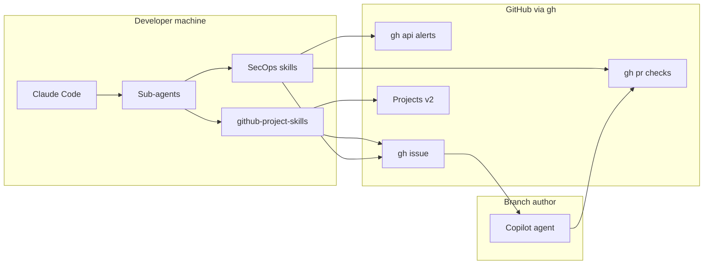
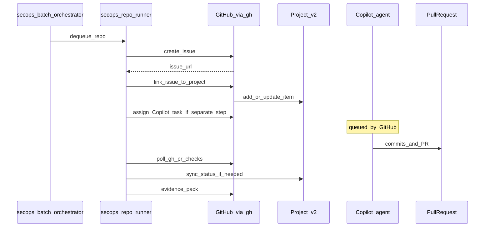
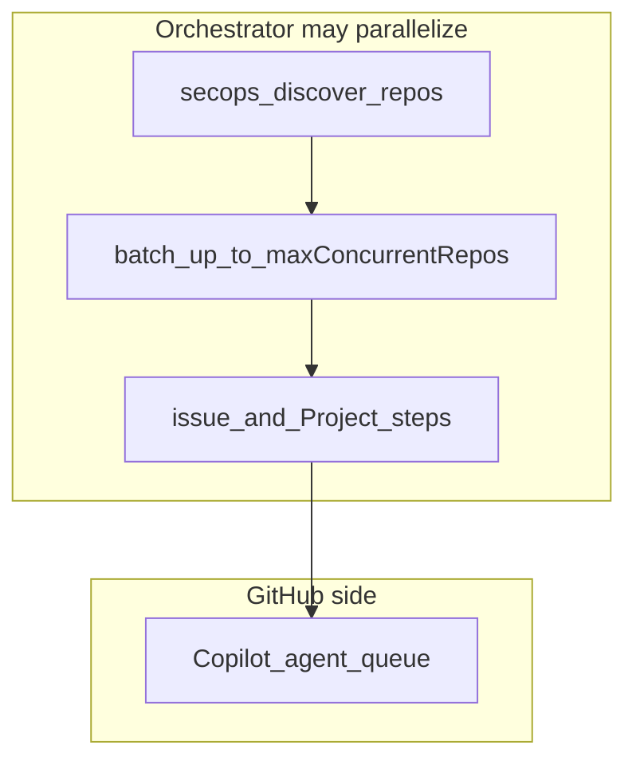
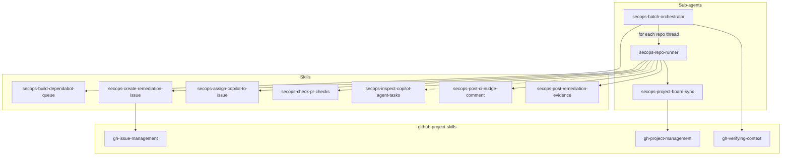
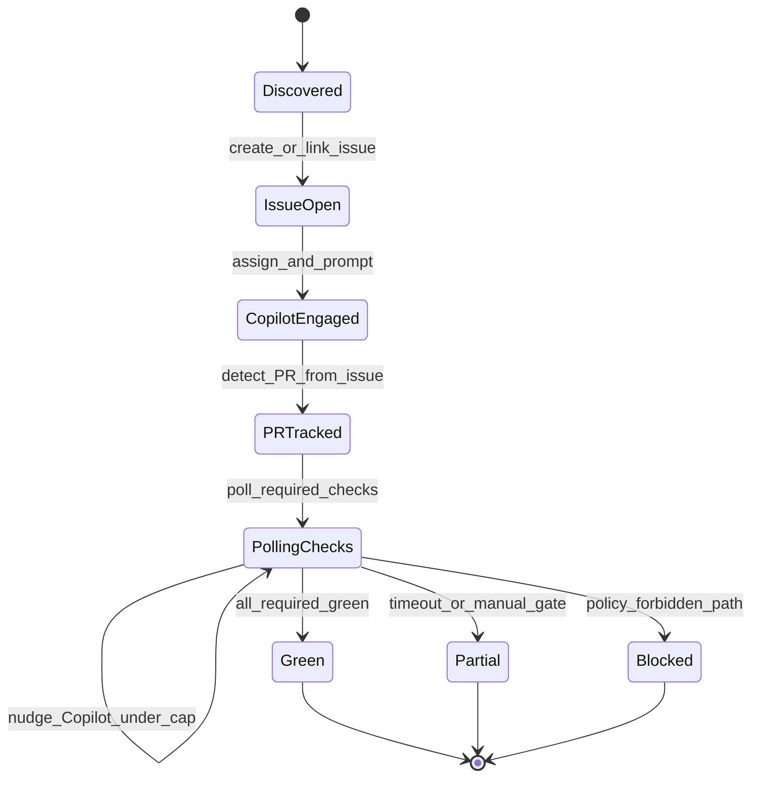

# Product design: SecOps dependency remediation orchestrator

This document describes the **GitHub SecOps agent** approach for **org-scale vulnerable dependency remediation** using **Claude Code**, **granular agent skills**, **sub-agents**, the **github-project-skills** plugin, and **`gh`** as the primary GitHub interface. **Only GitHub Copilot** authors commits on target branches; orchestration uses **Issues, Pull Requests, Comments, and GitHub Projects (v2)**—not direct pushes from this tooling.

## Goals

| Goal                  | Description                                                                                                                                                         |
| --------------------- | ------------------------------------------------------------------------------------------------------------------------------------------------------------------- |
| **MVP runtime**       | Interactive **Claude Code** on a developer machine (later: dedicated runner or CI).                                                                                 |
| **Integration**       | **GitHub-native** only: [`gh`](https://cli.github.com/), REST/GraphQL via `gh api`. No undocumented Copilot UI automation.                                          |
| **Branch authorship** | **Copilot only** on branches. Claude Code and these skills **do not** `git push` to target repos.                                                                   |
| **Done criterion**    | **Required checks** on the remediation PR are **green**, within **nudge rounds** and **poll limits**; otherwise **partial** with **explicit user-visible** notices. |
| **Discovery**         | **Allowlist + exclude list** intersected with repos that have **security findings** (e.g. Dependabot alerts via `gh api`).                                          |
| **Execution**         | **Priority queue** + **limited parallelism** of **repo threads** (`maxConcurrentRepos`); **not** parallel Copilot scheduling (GitHub queue).                        |
| **Visibility**        | **GitHub Project (v2)** as the human dashboard; state is derived from **`gh`** (PRs, checks, issues)—not by guessing from the browser.                              |
| **Evidence**          | Target: **structured issue/PR summary + orchestrator run log**; MVP may use **links-only** with a documented audit gap.                                             |

## Claude Code primitives

Design aligns with official documentation:

- **Skills:** [Skills](https://code.claude.com/docs/en/skills) — one **focused** skill per capability (discover vs submit vs check) for composability and smaller prompts.
- **Sub-agents:** [Sub-agents](https://code.claude.com/docs/en/sub-agents) — specialized agents for **batch orchestration** and **per-repo runners** that invoke skills in sequence.
- **Agent teams:** [Agent teams](https://code.claude.com/docs/en/agent-teams) — coordinator + workers: **batch orchestrator** + **repo runner** roles.

## `gh`-first policy

1. Prefer **`gh`** for everything it supports: `gh api` (`--paginate`, `-f`), `gh search repos`, `gh pr view`, `gh pr checks`, `gh issue`, `gh run list`, etc.
2. Use **`gh api`** for endpoints without a dedicated subcommand (e.g. org Dependabot alerts). Avoid `curl` + raw tokens when `gh` can attach credentials.
3. Optional helpers in [`packages/ghclt`](../packages/ghclt) should **invoke `gh`** (spawn/exec), not reimplement the REST API in TypeScript unless necessary.

## Architecture

### Role of [github-project-skills](https://github.com/yu-iskw/github-project-skills)

- **Auth:** `gh auth login` — single credential surface.
- **Project binding:** Skill **`gh-set-active-project`** writes `.github/project-config.json` in this repo (see [Configuration](#github-project-config)) so **`gh-verifying-context`** can validate the active Project.
- **Issues / Projects:** **`gh-issue-management`**, **`gh-project-management`** — boards, fields, triage.

**Boundary:** That plugin handles **generic** GitHub project workflows. This repository adds **SecOps-specific** skills (discovery, Copilot task text, PR check snapshots, evidence) and **sub-agents** that orchestrate **wait/retry loops** around those skills.

### Copilot task prompt

Remediation instructions for Copilot follow the supply-chain playbook (adapt per ecosystem):

- [Independent prompt to resolve vulnerable dependencies (gist)](https://gist.github.com/yu-iskw/7a7412abd7d332fc09f428b8d0d90998)

## Workflow order: Issue → Project → Copilot

Traceability is anchored on the **GitHub Project** and **issues**. The **canonical** sequence per repo thread is:

1. **Create the issue** (task description, alert context, link to gist)—skill **secops-create-remediation-issue**.
2. **Link the issue to the batch Project (v2)** and set initial **Status**—**secops-project-board-sync** sub-agent (via **gh-project-management**).
3. **Assign Copilot** when not done at create time—skill **secops-assign-copilot-to-issue** (org policy may require steps 1–2 before assign).
4. **Monitor CI**—sub-agents **repeatedly invoke** **secops-check-pr-checks** (read-only JSON, one shot per run); **nudge** on red checks—**secops-post-ci-nudge-comment**; then **secops-post-remediation-evidence** at terminal state.

### Concurrency: orchestrator vs Copilot queue

- **`maxConcurrentRepos`** (see [`.github-secops-agent.json.template`](../.github-secops-agent.json.template)) limits how many **repo threads** run **discovery, issue creation, Project linking, and polling** at once. It does **not** control GitHub’s **Copilot agent queue**—treat Copilot as **platform-managed** work.
- Design **does not** require parallel **Copilot** execution; optionally parallelize only **upstream** steps across repos.

### Kanban / Project status (two layers)

| Layer | Mechanism                                                           | When to use                                                                                        |
| ----- | ------------------------------------------------------------------- | -------------------------------------------------------------------------------------------------- |
| **A** | **Project automations** (built-in rules on the Project)             | **Prefer** when enabled: e.g. PR linked → column, issue closed → Done.                             |
| **B** | **secops-project-board-sync** sub-agent + **gh-project-management** | When automations do not cover states (**partial**, **manual CI**, **nudge round**, custom fields). |

Do **not** assume **Copilot** moves Project fields automatically—**verify** in a pilot. If it does not, rely on **A** and/or **B**.

## Granular skills and sub-agents

Formal boundaries (skills vs sub-agents, checklist for new skills): [ADR 0005: SecOps granular skills vs sub-agents](adr/0005-secops-granular-skills-vs-subagents.md).

### Skills (one `SKILL.md` per concern)

| Skill ID                               | Responsibility                                                                                                   |
| -------------------------------------- | ---------------------------------------------------------------------------------------------------------------- |
| **secops-build-dependabot-queue**      | Load `.github-secops-agent.json`; intersect allow/exclude with repos having alerts; emit **priority queue**.     |
| **secops-create-remediation-issue**    | Create **issue** with gist prompt + optional assign/project in one step when allowed.                            |
| **secops-assign-copilot-to-issue**     | Assign **@copilot** on an existing issue (e.g. after Project link).                                              |
| **secops-check-pr-checks**             | Find PR; **one-shot** check of **required checks**; JSON outcome + exit codes only (read-only). Sub-agents loop. |
| **secops-inspect-copilot-agent-tasks** | List/view **Copilot agent task** sessions via `gh agent-task` (preview); not a substitute for PR checks.         |
| **secops-post-ci-nudge-comment**       | Post **nudge** issue comments from continuation policy; does not run PR checks.                                  |
| **secops-post-remediation-evidence**   | Append **evidence** (MVP: links; target: summary + run log).                                                     |

**Composition:** Discover → **Submit (issue)** → **Project sync (link, sub-agent)** → **Assign Copilot (if deferred)** → Check (sub-agent loop) → **Nudge (when failing)** → Project sync sub-agent (as needed) → Post-remediation evidence. Optionally use **secops-inspect-copilot-agent-tasks** to inspect agent task sessions (preview CLI); it does **not** replace **secops-check-pr-checks** for merge/check status. Each skill is invokable **alone** for debugging; Project sync is a **sub-agent** (see below).

### Sub-agents

| Sub-agent                     | Role                                                                                                                                            |
| ----------------------------- | ----------------------------------------------------------------------------------------------------------------------------------------------- |
| **secops-batch-orchestrator** | Reads config; runs discover; schedules **priority queue** + **concurrency**; delegates per-repo work; surfaces **partial/blocked** to the user. |
| **secops-repo-runner**        | Single-repo **state machine**: submit → poll/nudge → sync Project → evidence.                                                                   |
| **secops-project-board-sync** | Update Project fields via plugin skills (`gh-project-management`, `gh-verifying-context`).                                                      |

## State machine (per target repo)

**Copilot assignment:** Document the exact **mention/assign** pattern your org supports (e.g. `@copilot` / assign to Copilot). Re-post **Phase B/C** (lint/tests/CI loop) instructions when checks fail—same intent as manual follow-ups in the gist.

## Configuration

- **SecOps policy:** [`.github-secops-agent.json`](../.github-secops-agent.json.template) (copy template to repo root or path documented in `CLAUDE.md`). Field descriptions live in the template.
- **GitHub Project binding:** [`.github/project-config.json`](#github-project-config) — produced by **`gh-set-active-project`** from [github-project-skills](https://github.com/yu-iskw/github-project-skills).

### GitHub Project config

After installing **github-project-skills**, a maintainer runs the **`gh-set-active-project`** skill once so `.github/project-config.json` declares the **active** Project v2 for this orchestrator repo. Commit the file so all clones share context; restrict edits via **CODEOWNERS** (see [.github/CODEOWNERS](../.github/CODEOWNERS)).

Suggested **custom fields** (examples; align with your org’s Project):

| Field      | Purpose                                                 |
| ---------- | ------------------------------------------------------- |
| Status     | Backlog / Copilot / PR / CI / Green / Partial / Blocked |
| TargetRepo | `owner/name`                                            |
| PR         | URL                                                     |
| Blocker    | `manual_ci`, `copilot_stall`, `policy`, …               |
| Round      | Current nudge round                                     |
| UpdatedAt  | ISO timestamp                                           |

## Evidence modes

| Mode                        | Contents                                                                                                              |
| --------------------------- | --------------------------------------------------------------------------------------------------------------------- |
| **mvp_links_only**          | Links to issue, PR, required check runs; **audit gap** documented.                                                    |
| **structured_plus_run_log** | Issue/PR **structured summary** (GHSA/CVE, packages, versions) + **timestamped run log** (nudges, state transitions). |

## Risk register

| Risk                    | Mitigation                                                                                                                                  |
| ----------------------- | ------------------------------------------------------------------------------------------------------------------------------------------- |
| **Copilot stalls**      | Nudge comments; **round cap**; mark **partial**; user-visible summary.                                                                      |
| **Manual CI approvals** | Poll until timeout; label **blocked:manual-ci**; recommend repo policy (e.g. dependency PRs without deployment environments) where allowed. |
| **API 403 / GHAS**      | Document required **org roles** and **token** scopes; degrade to repo-scoped discovery if org API unavailable.                              |
| **Evidence gap (MVP)**  | Call out explicitly when only **links** are recorded.                                                                                       |

## Verification checklist

- [ ] **github-project-skills** installed; **`gh-set-active-project`** run; `.github/project-config.json` committed.
- [ ] One **end-to-end** dry run: Project item → issue → PR → `gh pr checks` loop → partial path with **blocker** comment if needed.
- [ ] Each **skill** invocable in isolation (e.g. check-only on a known issue URL).

## Out of scope

- Hosted 24/7 orchestrator (phase 2).
- Claude Code **pushing** to target repo branches.
- Replacing Copilot with Actions-only remediation (alternative track).

## References

- [Skills (Claude Code)](https://code.claude.com/docs/en/skills)
- [Sub-agents](https://code.claude.com/docs/en/sub-agents)
- [Agent teams](https://code.claude.com/docs/en/agent-teams)
- [github-project-skills](https://github.com/yu-iskw/github-project-skills)
- [Supply-chain remediation prompt (gist)](https://gist.github.com/yu-iskw/7a7412abd7d332fc09f428b8d0d90998)
