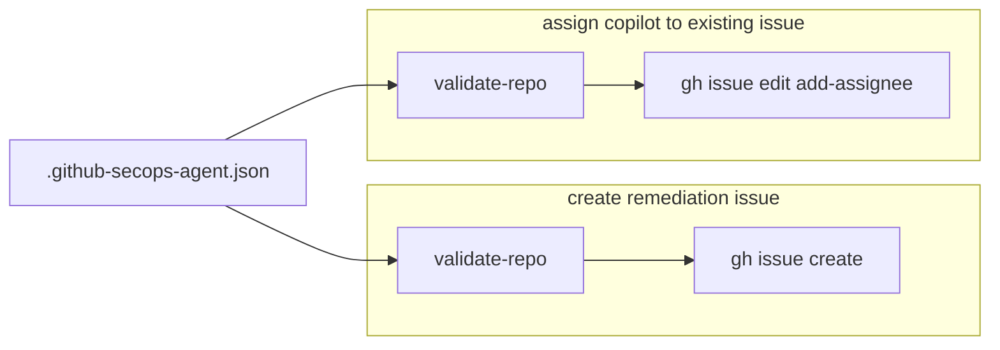
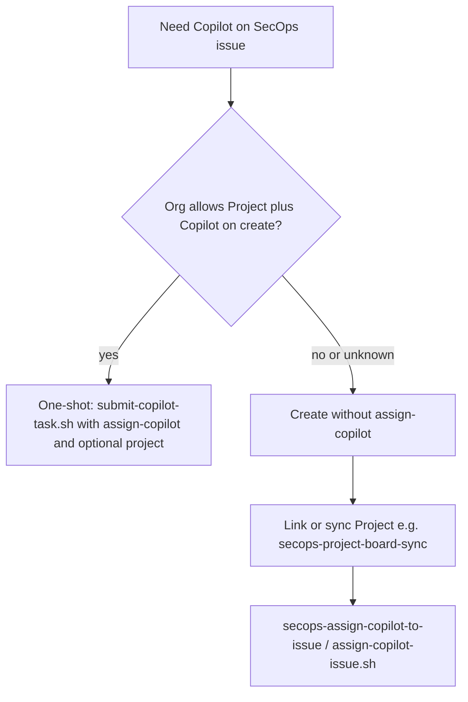
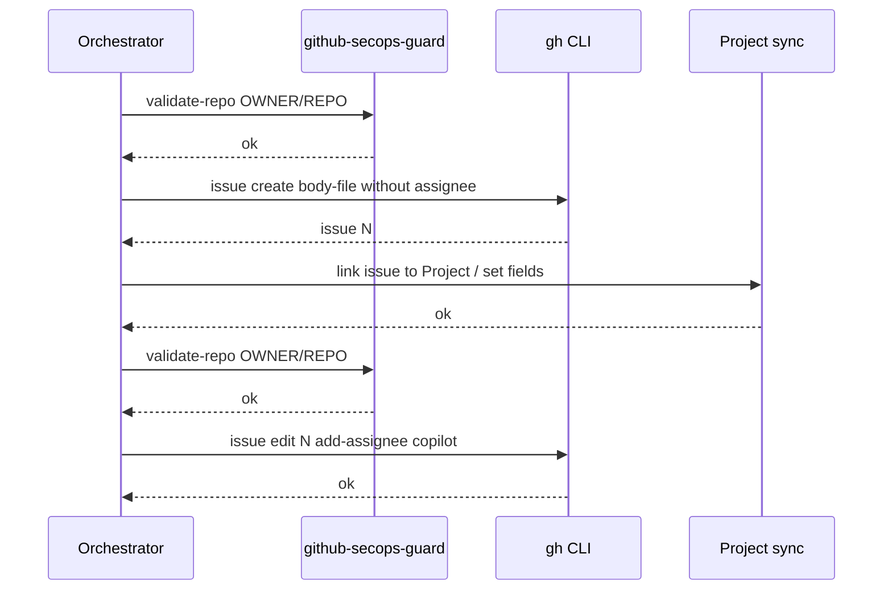

# SecOps: Copilot issue assignment (one-shot vs deferred)

This document operationalizes the **recommended approach** for assigning **`@copilot`** on SecOps remediation issues: keep **[secops-assign-copilot-to-issue](../.claude/skills/secops-assign-copilot-to-issue/SKILL.md)** for **policy-guarded assign-only** on **existing** issues (deferred **Issue → Project → Copilot**), and use **[submit-copilot-task.sh](../.claude/skills/secops-create-remediation-issue/scripts/submit-copilot-task.sh)** with **`--assign-copilot`** (and optional **`--project`**) when org policy allows **one-shot create + assign**. Both paths run **`github-secops-guard validate-repo`** before mutating **`gh`**.

Related: [Product design](produt_design.md), [ADR 0004](adr/0004-issue-project-copilot-workflow-order-and-kanban.md), [ADR 0002](adr/0002-secops-policy-guardrails-and-skill-shell-scripts.md), [ADR 0005](adr/0005-secops-granular-skills-vs-subagents.md).

## Stated vs underlying goal

| Layer              | Content                                                                                                                                                                                              |
| ------------------ | ---------------------------------------------------------------------------------------------------------------------------------------------------------------------------------------------------- |
| **Stated (X)**     | “If one `gh` command can create and assign, we might not need **secops-assign-copilot-to-issue**.”                                                                                                   |
| **Underlying (Y)** | Safe, repeatable automation: **never** assign Copilot on a repo that policy should block, and support **both** (a) **one-shot** create+assign and (b) **deferred** assign after Project/board steps. |

**Recommendation:** **Do not remove** [secops-assign-copilot-to-issue](../.claude/skills/secops-assign-copilot-to-issue/SKILL.md). It is not a duplicate of “create issue”; it is the **second verb** for **`gh issue edit`** after the issue exists. [submit-copilot-task.sh](../.claude/skills/secops-create-remediation-issue/scripts/submit-copilot-task.sh) documents the split in its usage text (lines 22–26).

## Conceptual model: two verbs, one guard

Both entry points run **`validate-repo`** before **`gh`**:



- **Create path:** [`packages/ghclt`](../packages/ghclt) `validate-repo` then **`gh issue create`** via [submit-copilot-task.sh](../.claude/skills/secops-create-remediation-issue/scripts/submit-copilot-task.sh).
- **Assign path:** same **`validate-repo`**, then **`gh issue edit … --add-assignee "@copilot"`** ([assign-copilot-issue.sh](../.claude/skills/secops-assign-copilot-to-issue/scripts/assign-copilot-issue.sh)).

Removing the assign skill would not remove the need for **`gh issue edit`** when assign is deferred; it would only remove **named documentation + the guarded script**.

## Decision: when to use which flow



| Situation                   | Skill / script                                                                                                                                                           | Why                                                                        |
| --------------------------- | ------------------------------------------------------------------------------------------------------------------------------------------------------------------------ | -------------------------------------------------------------------------- |
| **Single step** allowed     | [submit-copilot-task.sh](../.claude/skills/secops-create-remediation-issue/scripts/submit-copilot-task.sh) `--assign-copilot` (optional `--project` repeated)            | Issue body + assign (+ projects) in one **`gh issue create`** after guard. |
| **Project before assignee** | Create **without** `--assign-copilot` → board/Project step → [assign-copilot-issue.sh](../.claude/skills/secops-assign-copilot-to-issue/scripts/assign-copilot-issue.sh) | Issue number exists; only **`gh issue edit`** is appropriate.              |

## Sequence: deferred assign



This is **not** expressible as a single `gh issue create` if assign must happen **after** Project work.

## Code examples

### 1) One-shot create + optional Copilot + optional Project

```bash
# From orchestrator repo root
pnpm --filter @github-secops-agent/ghclt build
.claude/skills/secops-create-remediation-issue/scripts/submit-copilot-task.sh \
  --repo OWNER/REPO \
  --body-file /tmp/secops-task.md \
  --assign-copilot \
  --project "Batch Project Title"
```

### 2) Deferred assign on an existing issue

Core of [assign-copilot-issue.sh](../.claude/skills/secops-assign-copilot-to-issue/scripts/assign-copilot-issue.sh):

```bash
node "$CLI" validate-repo "$REPO" --config "$CONFIG"
exec gh issue edit "$ISSUE" --repo "$REPO" --add-assignee "@copilot"
```

**Raw `gh` equivalent** (without guard — discouraged for SecOps orchestration):

```bash
gh issue edit 42 --repo OWNER/REPO --add-assignee "@copilot"
```

### 3) Building `body-file` (create skill)

Issue body concatenates the canonical prompt from [security_remedation_prompt.md](../.claude/skills/secops-assign-copilot-to-issue/references/security_remedation_prompt.md) plus Tracking/Alerts — see [secops-create-remediation-issue/SKILL.md](../.claude/skills/secops-create-remediation-issue/SKILL.md) (“Building `task.md`”). The assign skill covers **assignee** when create omitted `--assign-copilot`; it does not replace body assembly.

## Optional: thinning the surface

If every environment **guarantees** one-shot create+assign+project, you could merge assign documentation into the create SKILL and keep only `assign-copilot-issue.sh` without its own SKILL — **trade-off:** worse **agent discovery** for the verb “assign Copilot” ([ADR 0005](adr/0005-secops-granular-skills-vs-subagents.md)).

**Default:** keep the separate skill so orchestrators have a **single named step** for deferred assign.

## Verification checklist

- **Policy:** `validate-repo` passes for `OWNER/REPO` before any `gh` mutating call.
- **Deferred path:** Issue number known → `assign-copilot-issue.sh --repo … --issue …`.
- **One-shot path:** Same repo validated at create; optional `--assign-copilot` / `--project` per script.
- **Confusion guard:** [secops-inspect-copilot-agent-tasks](../.claude/skills/secops-inspect-copilot-agent-tasks/SKILL.md) points to **secops-assign-copilot-to-issue** for **issue assignee** (not `gh agent-task`).

## Summary

| Question                                                                        | Answer                                                                             |
| ------------------------------------------------------------------------------- | ---------------------------------------------------------------------------------- |
| Does one `gh issue create` + assign replace **secops-assign-copilot-to-issue**? | **Only** for flows where assign at create is allowed.                              |
| What does the assign skill add?                                                 | **Guarded** `gh issue edit` for **existing** issues after Project/policy ordering. |
| Recommended approach                                                            | **Keep both** primitives; choose flow with the **decision diagram** above.         |
